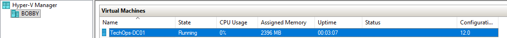
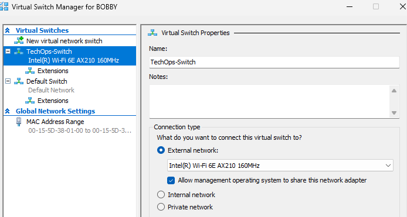
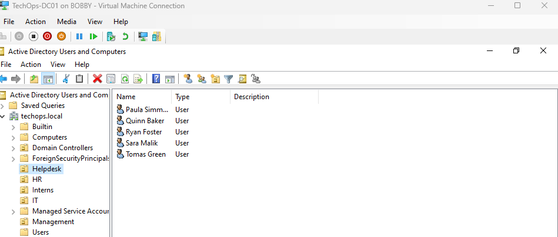
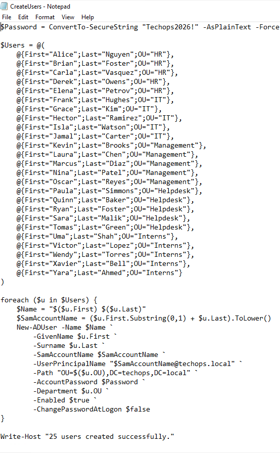
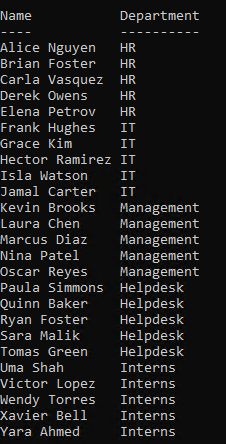
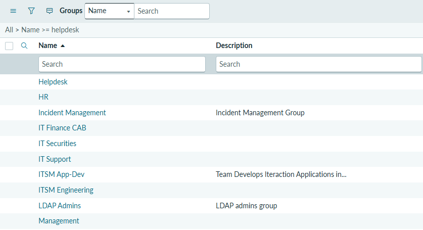
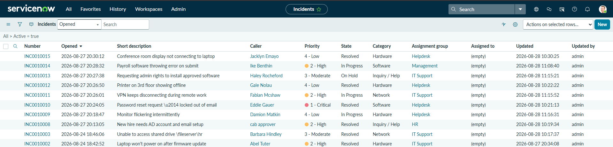
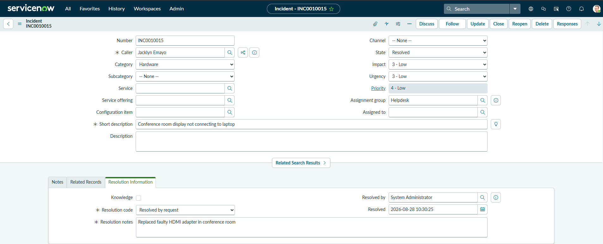

# TechOps Homelab — IT Infrastructure & Ticketing System

A self-built homelab simulating a small business IT environment, covering Active Directory administration, network configuration, and IT service management (ITSM) ticketing — built to demonstrate practical help desk and desktop support skills.

## Overview

This project recreates a realistic corporate IT environment from scratch, combining:
- A Windows Server Active Directory domain running on Hyper-V
- A cloud-hosted ServiceNow instance for incident ticket management
- Full-lifecycle ticket handling across multiple departments

## Environment

| Component | Details |
|---|---|
| Hypervisor | Microsoft Hyper-V (Windows 11 Pro host) |
| Host hardware | Intel i7-11700K, 16GB RAM, RTX 3060 |
| Domain Controller | Windows Server 2022 (Standard, Desktop Experience) |
| Domain | `techops.local` |
| Ticketing platform | ServiceNow (Personal Developer Instance) |

## Active Directory Structure

Built a domain with 5 Organizational Units representing typical business departments:

- **HR**
- **IT**
- **Management**
- **Helpdesk**
- **Interns**

25 user accounts were provisioned across these OUs via a PowerShell bulk-creation script, each with department attributes set — enabling realistic group-based user management, similar to onboarding workflows in a real organization.

```powershell
New-ADUser -Name $Name -SamAccountName $SamAccountName `
    -UserPrincipalName "$SamAccountName@techops.local" `
    -Path "OU=$($u.OU),DC=techops,DC=local" `
    -AccountPassword $Password -Department $u.OU -Enabled $true
```

## Ticketing System (ServiceNow)

Configured a ServiceNow Personal Developer Instance as the ITSM ticketing layer:

- Created 4 custom **Assignment Groups** mapped to AD departments: IT Support, HR, Helpdesk, Management
- Logged 10 incident tickets covering common help desk scenarios: hardware failures, network/VPN issues, password resets, access requests, and software errors
- Managed tickets through a full lifecycle — **New → In Progress / On Hold → Resolved** — with proper resolution notes and resolution codes on each closed ticket, mirroring real SLA-driven ticket handling

### Sample ticket categories handled
- Hardware (laptop failures, monitor/printer issues, conference room AV)
- Network (VPN disconnects, shared drive access)
- Software (application errors, account lockouts)
- Access requests (new hire provisioning, admin rights)

## Skills Demonstrated

- Windows Server installation and configuration
- Active Directory Domain Services setup and OU/user management
- PowerShell scripting for bulk account provisioning
- Static IP and network configuration in a virtualized environment
- Hyper-V virtual machine and virtual switch administration
- ITSM ticketing workflows: intake, categorization, prioritization (Impact/Urgency), assignment, and resolution
- Incident lifecycle management aligned with ITIL-style practices

## Screenshots

*(Place image files in a `screenshots/` folder alongside this README, using the filenames below.)*

### Infrastructure


*`TechOps-DC01` running under Hyper-V on the host machine, showing live uptime and assigned memory.*


*External virtual switch (`TechOps-Switch`) bound to the host's network adapter, giving VMs real network access.*

### Active Directory


*The five Organizational Units (HR, IT, Management, Helpdesk, Interns) under `techops.local`, with the Helpdesk OU expanded to show its provisioned users.*


*The `CreateUsers.ps1` script used to bulk-provision 25 user accounts across the five OUs.*


*`Get-ADUser` output confirming all 25 accounts were created with the correct department attribute.*

### ServiceNow Ticketing


*Custom Assignment Groups (HR, IT Support, Management, Helpdesk) created to route incidents by department.*


*Ten incidents spanning the full ticket lifecycle — Resolved, In Progress, On Hold, and New — across varied categories and priorities.*


*A resolved incident showing complete resolution information: resolution code, resolution notes, resolved-by, and timestamp.*

## Notes

This is a learning/portfolio project built independently to prepare for entry-level IT support and help desk roles.
